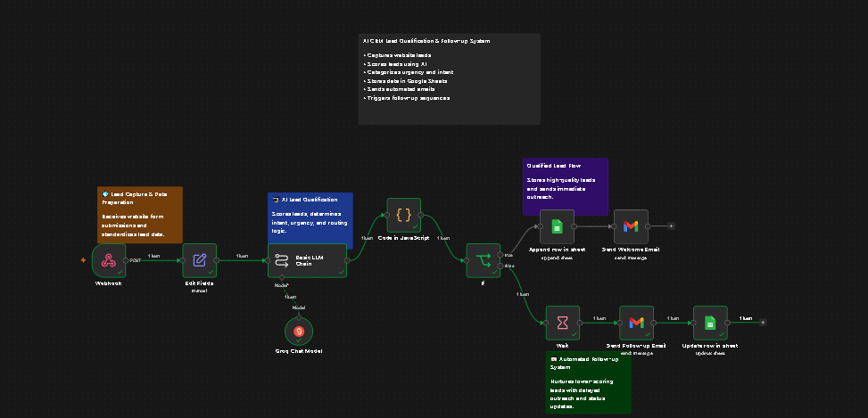

# AI-Powered Lead Qualification & Automated Follow-Up CRM

An intelligent CRM automation workflow built in n8n to capture, score, qualify, and follow up with inbound leads automatically.

## Overview

This workflow automates the lead qualification process by combining AI scoring with workflow automation.

It captures leads via webhook, evaluates them based on budget, intent, urgency, and company details, and routes them into different follow-up paths.

## Features

* Website lead capture via webhook
* AI-based lead scoring
* Intent and urgency analysis
* Dynamic routing using IF logic
* Automated email outreach
* Delayed follow-up sequences
* CRM tracking in Google Sheets

## Workflow Architecture

Webhook → Data Structuring → AI Analysis → Response Parsing → Lead Routing

### Qualified Leads

* Stored in Google Sheets
* Immediate email response

### Warm Leads

* Delayed follow-up after 2 days
* Lead status updated in CRM

## Tech Stack

* n8n
* Groq LLM
* Gmail API
* Google Sheets API
* Webhooks

## Workflow Preview

## Demo

See demo.mp4 in repository files.

## Results

Lead records and statuses are tracked in Google Sheets.

## Author

Maaz Hasan
